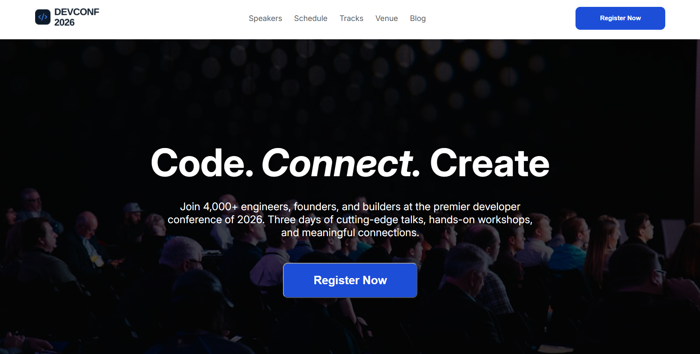

Create a modern HTML and CSS "Job Board & Career Hub" section for a developer conference website called "DevConf2026". Include a section heading, an introduction, 3/4 cards with unique roles, career benefits and an actionable button using professional design.# DevConf 2026 🚀

A modern and responsive landing page for **DevConf 2026**, a developer conference website built with HTML and CSS.

## 🌐 Live Demo

**Live Demo:** [Demo](https://ahmedzubaer911.github.io/A-01-DevConf-2026/)

> The project will be deployed after completing the GitHub Pages setup.

## 📸 Project Preview



## 📖 About The Project

**DevConf 2026** is a responsive developer conference landing page designed to provide information about a fictional technology conference.

The website features a modern hero section, speaker profiles, conference pricing plans, career opportunities, and a responsive footer with social media icons.

This project was built as a frontend development assignment to practice **HTML structure, CSS styling, responsive design, layout techniques, and external resources**.

## ✨ Features

* 🎤 **Hero Section**

  * Conference introduction
  * "Code. Connect. Create." headline
  * Registration call-to-action

* 👨‍💻 **Speakers Section**

  * Featured speaker profiles
  * Speaker names and designations
  * Technology tracks including AI/ML, Cloud & DevOps, Frontend, and Security

* 💳 **Pricing Section**

  * Standard plan
  * Pro plan
  * Team plan
  * Feature comparison for each plan

* 💼 **Career Hub**

  * Technology companies and available roles
  * Cloud & DevOps opportunities
  * Cybersecurity opportunities
  * AI/ML opportunities
  * Frontend development opportunities

* 📱 **Responsive Design**

  * Responsive layouts for different screen sizes
  * Mobile-friendly sections

* 🔗 **Footer**

  * Social media icons
  * Privacy Policy and Terms of Service links
  * Copyright information

## 🛠️ Technologies Used

<p>
  
  
</p>

### External Resources

* [Google Fonts](https://fonts.google.com/) – Inter font
* [Font Awesome](https://fontawesome.com/) – Icons

## 📂 Project Structure

```text
A-01-DevConf-2026/
│
├── images/
│   ├── logo.png
│   ├── footer.png
│   ├── andrej.png
│   ├── demis.png
│   ├── gary.png
│   └── mustafa.png
│
├── index.html
├── styles.css
├── PROMPTS.md
├── screenshot.png
└── README.md
```

## 🚀 Getting Started

Follow these steps to run the project on your local machine.

### Prerequisites

You only need:

* A modern web browser
* A code editor such as VS Code

Using **VS Code Live Server** is recommended but not required.

### Installation

#### 1. Clone the repository

```bash
git clone https://github.com/ahmedZubaer911/A-01-DevConf-2026.git
```

#### 2. Navigate to the project directory

```bash
cd A-01-DevConf-2026
```

#### 3. Open the project

Open `index.html` directly in your browser.

Or, if you have the **Live Server** extension installed in VS Code:

1. Open the project in VS Code.
2. Right-click `index.html`.
3. Select **Open with Live Server**.

## 🎨 Design Highlights

The website uses a clean and modern visual style with:

* Dark hero section with a conference background image
* Blue primary accent color
* Card-based layouts
* Clear typography and spacing
* Hover effects
* Responsive grid layouts
* Inter font for modern typography

## 📋 Main Sections

| Section    | Description                                  |
| ---------- | -------------------------------------------- |
| Navigation | Website navigation and registration button   |
| Hero       | Conference introduction and registration CTA |
| Speakers   | Featured developer and technology speakers   |
| Pricing    | Standard, Pro, and Team registration plans   |
| Career Hub | Technology companies and job opportunities   |
| Footer     | Social media icons, policies, and copyright  |

## 🔧 Dependencies

This project does not require any package manager or JavaScript framework.

External resources used:

* **Google Fonts** – Inter font
* **Font Awesome** – Icons

An internet connection may be required for the external Google Fonts and Font Awesome resources to load correctly.

## 🌱 Future Improvements

Possible improvements for future versions include:

* Add functional registration forms
* Add working navigation links
* Add a detailed conference schedule
* Add speaker profile pages
* Add functional social media links
* Add backend functionality for registration
* Add JavaScript interactions and form validation
* Deploy the website using GitHub Pages

## 📚 What I Learned

Through this project, I practiced:

* Structuring webpages with semantic HTML
* Creating responsive layouts with CSS
* Using CSS Grid and Flexbox
* Designing reusable card components
* Working with images and external resources
* Creating responsive sections for different screen sizes
* Using Git and GitHub for version control

## 🔗 Links

* **Repository:** [A-01-DevConf-2026](https://github.com/ahmedZubaer911/A-01-DevConf-2026)
* **Live Demo:** [Demo](https://ahmedzubaer911.github.io/A-01-DevConf-2026/)

## 👨‍💻 Author

**Ahmed Zubaer**

GitHub: [@ahmedZubaer911](https://github.com/ahmedZubaer911)

## 📄 License

This project was created for educational purposes.
